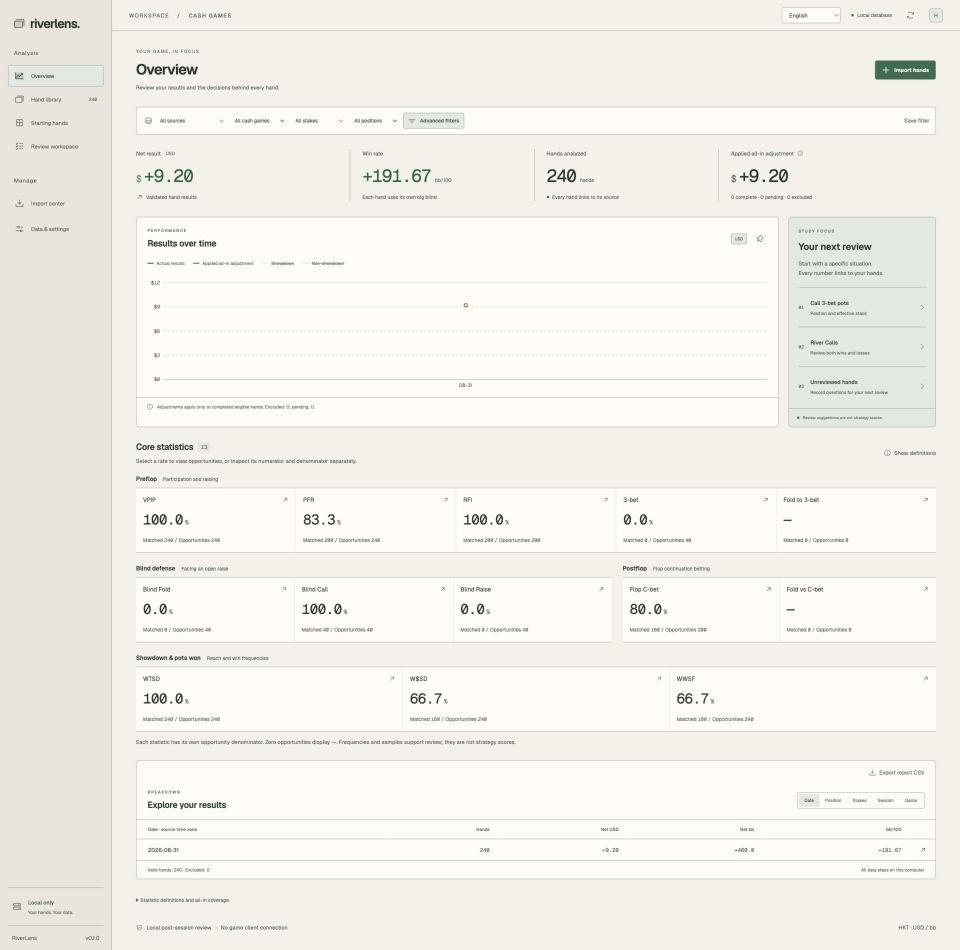
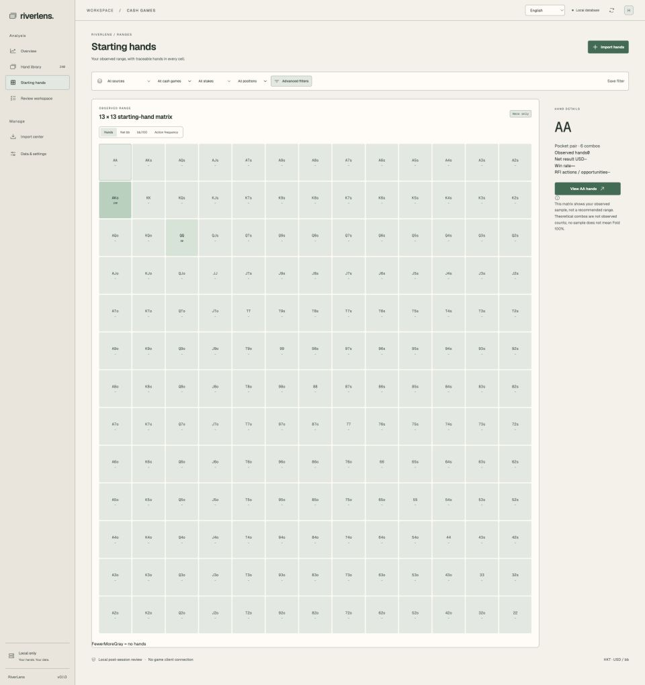

# RiverLens

**Suas mãos. Seus dados. Um espaço local para revisar suas sessões de pôquer.**

[English](README.md) · [繁體中文](README.zh-TW.md) · [简体中文](README.zh-CN.md) · [日本語](README.ja.md) · [한국어](README.ko.md) · [Français](README.fr.md) · [Deutsch](README.de.md) · [Español](README.es.md) · [Português (Brasil)](README.pt-BR.md) · [Italiano](README.it.md) · [Nederlands](README.nl.md) · [Polski](README.pl.md) · [Türkçe](README.tr.md)

RiverLens é um aplicativo de desktop para analisar seus próprios históricos de mãos de cash game já encerradas no Natural8 / GGPoker. Usa React / TypeScript na interface, Rust no processamento e nas estatísticas e SQLite local no armazenamento.

> Prévia pública. v0.1.0 disponibiliza apenas código-fonte, sem instaladores assinados. A validação em máquinas Windows / Intel ainda não foi concluída. main acrescenta temas e traduções do README. Os READMEs estão em 13 idiomas; a interface continua em inglês, chinês tradicional e chinês simplificado.

## Recursos

- Importação de TXT, ZIP ou pastas; progresso, pausa/retomada, detecção de duplicatas e isolamento de registros anômalos.
- Resultados líquidos, bb/100 e detalhamento por sessão ou posição, com acesso às mãos.
- 13 estatísticas: VPIP, PFR, RFI, 3-bet, defesa dos blinds e frequências pós-flop/showdown, com numeradores e denominadores de oportunidades explícitos.
- Matriz de mãos iniciais 13 × 13: quantidade, net bb, bb/100 e frequência de ação.
- Replay ação por ação, navegação entre streets e exibição das cartas conhecidas.
- Notas, tags, estado de revisão e filtros salvos.
- SQLite local, exportação CSV / históricos, backup e restauração.
- Temas Forest, Midnight e Paper (branco quente), com escolha salva localmente.
- Equity all-in nos casos compatíveis: heads-up, pote único, cartas fechadas conhecidas e runout único. Não é decision EV nem pontuação GTO.

## Capturas de tela

Capturas da página inteira no tema Paper, com largura de 1920px. Usam somente 240 mãos sintéticas, sem dados privados. As frequências e ganhos dessa amostra repetitiva não representam resultados reais. A matriz mostra mãos observadas, não um range recomendado.





## Primeiros passos

Requer Node.js 22+, Rust stable e as ferramentas da plataforma Tauri: Xcode Command Line Tools no macOS; MSVC C++ Build Tools e WebView2 no Windows.

[Tauri](https://v2.tauri.app/start/prerequisites/)

```sh
git clone https://github.com/G-Loop-co/riverlens.git
cd riverlens
npm ci
npm run desktop
```

1. Exporte suas mãos concluídas do PokerCraft em TXT / ZIP.
2. Em Data & settings, confirme a marca, o nome Hero e o fuso horário do texto do histórico.
3. Importe pelo Import center e explore resultados, matriz e replays.
4. Salve notas e faça backups regularmente.

## Desenvolvimento

Inicie o Rust core no terminal 1 e a prévia do navegador no terminal 2. O desktop usa Tauri IPC e diálogos nativos; a prévia utiliza o mesmo motor com entrada de caminhos para desenvolvimento.

```sh
# Terminal 1
npm run serve:core
# Terminal 2 — http://127.0.0.1:1420
npm run dev
```

```sh
npm test
npm run core:test
npm run build
node scripts/cargo.mjs clippy -p poker-core --all-targets -- -D warnings
npm run desktop:build -- --bundles app
# Windows
npm run desktop:build -- --target x86_64-pc-windows-msvc --bundles nsis
```

Os dados ficam em app-data do Tauri (app.riverlens.desktop); os ajustes exibem o caminho real. O desenvolvimento no navegador usa .local/riverlens.db. Para SQLite ativo, use o backup integrado para incluir os dados do WAL.

## Escopo e licença

Para revisão pessoal offline após a sessão. Sem conexão ao cliente do jogo, HUD ao vivo, RTA, mineração de dados populacionais, sincronização na nuvem ou avaliação GTO da melhor ação. Sem vínculo com Natural8 / GGPoker. O repositório é público, mas ainda não foi escolhida uma licença geral de reutilização. Não presuma MIT / Apache para o próprio RiverLens. Componentes de terceiros mantêm suas licenças.

## Documentação

[User guide — 繁體中文](docs/user-guide.md) · [Architecture](docs/architecture.md) · [Validation](docs/validation.md) · [Research](docs/research-matrix.md) · [Changelog](CHANGELOG.md) · [Third-party components](THIRD_PARTY.md) · [Releases](https://github.com/G-Loop-co/riverlens/releases)
