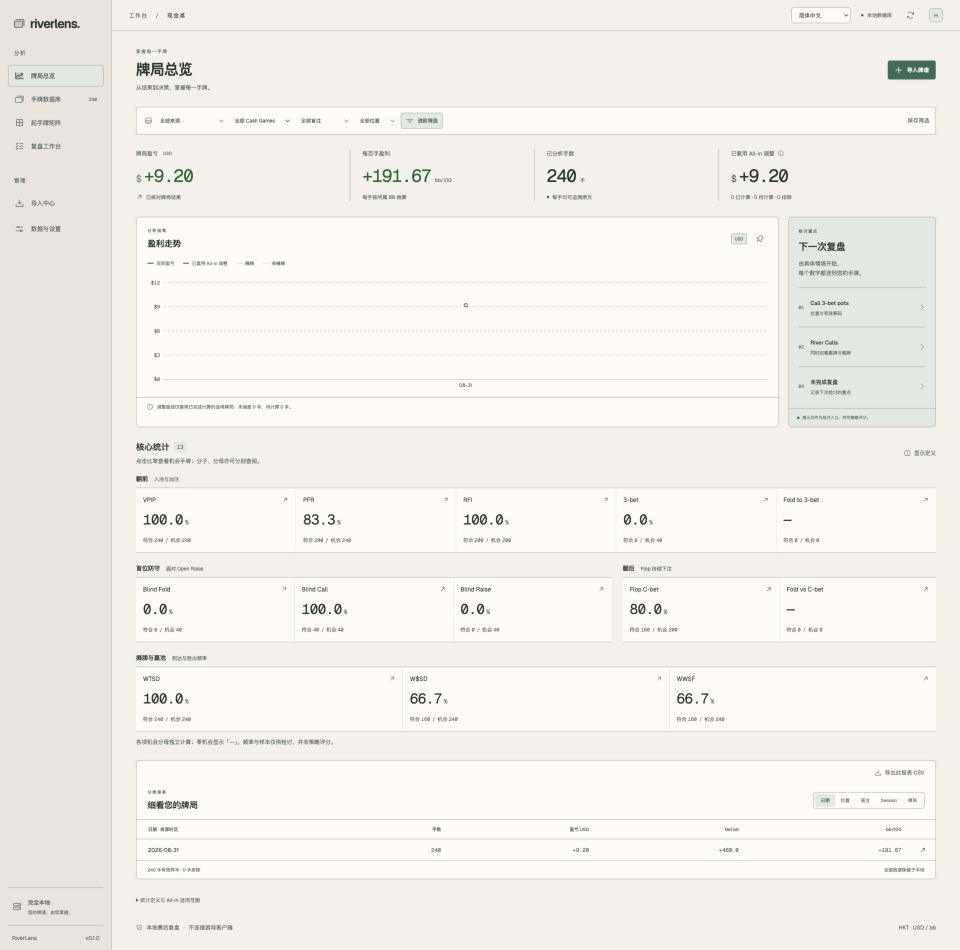

# RiverLens

**您的牌谱，由您掌握。完全本机的赛后 Poker 复盘工作台。**

[English](README.md) · [繁體中文](README.zh-TW.md) · [简体中文](README.zh-CN.md) · [日本語](README.ja.md) · [한국어](README.ko.md) · [Français](README.fr.md) · [Deutsch](README.de.md) · [Español](README.es.md) · [Português (Brasil)](README.pt-BR.md) · [Italiano](README.it.md) · [Nederlands](README.nl.md) · [Polski](README.pl.md) · [Türkçe](README.tr.md)

RiverLens 是 Natural8／GGPoker 个人现金桌牌谱分析桌面工具。介面使用 React／TypeScript，Rust core 负责解析、统计与本机 SQLite 储存。

> **v0.1.0 公开预览版：仅发布原始码。** 请依下方指令自行建置；未附已签署安装包。Windows 与 Intel 原生实机验收尚未完成，详见[验证纪录](docs/validation.md)。



README 共 **13 种语言**；App 界面维持 **English／繁体中文／简体中文**。目前 `main` 已加入外观主题；`v0.1.0` tag 保留原始发布快照。

当前 `main`：**v0.2.0** 新增 Spot Explorer、自定义目标 Leak Finder、来源策略翻前对照及 Trainer。「**数据与设置 → 外观主题**」提供森林绿、午夜蓝、暖白并保存选择。策略包需自行提供，频率对照不是 decision EV。详见[学习工作台](docs/study-workflow.md)及[主题](docs/theme-selection.md)。

## 功能

| 功能 | 用途 |
| --- | --- |
| 汇入中心 | 汇入 TXT、ZIP 或资料夹；查看进度、暂停／续汇、去重及异常隔离。 |
| 盈亏总览 | 查看净盈亏、bb/100、Session 与位置分类，点入原始手牌。 |
| 13 项核心统计 | VPIP、PFR、RFI、3-bet、盲位防守及翻后／摊牌频率；分子、机会分母可分别查阅。 |
| 13 × 13 起手牌矩阵 | 查看实际样本、net bb、bb/100、行动频率，开启对应手牌。 |
| 手牌回放 | 逐步行动、跳街、自动播放及已知底牌。 |
| 复盘工作台 | 保存笔记、标签、已复盘状态及常用筛选。 |
| 本机资料管理 | SQLite 储存、CSV／牌谱汇出、备份及还原。 |
| 三语介面 | 即时切换繁中、简中及 English，离线可用。 |
| 适用 All-in equity | 支援单挑、单底池、已知底牌、单 runout 的适用情况；不是 decision EV 或 GTO 评分。 |


截图采用 **1920px 桌面宽度、完整页面、暖白主题**；另提供 [1920 × 1080 完整窗口](docs/screenshots/overview-desktop-en.jpg)。

截图全部使用 **240 手合成资料**，不包含私人牌谱。重复样本仅示范介面，不代表真实玩家频率或策略建议。矩阵呈现已观察手牌，并非建议范围。

## 开始使用

需要 Node.js 22+、Rust stable 及 [Tauri 平台前置工具](https://v2.tauri.app/start/prerequisites/)：macOS 使用 Xcode Command Line Tools；Windows 使用 MSVC C++ Build Tools 与 WebView2。

```sh
git clone https://github.com/G-Loop-co/riverlens.git
cd riverlens
npm ci
npm run desktop
```

1. 从 PokerCraft 汇出自己已完成的 TXT／ZIP 牌谱。
2. 在「资料与设定」确认品牌、Hero 名称及**牌谱内文时区**。
3. 在「汇入中心」汇入档案。
4. 查看总览、矩阵及逐手回放。
5. 保存笔记，定期备份资料库。

## 本机开发

```sh
# Terminal 1：Rust core，只绑定 127.0.0.1
npm run serve:core
# Terminal 2：浏览器预览 http://127.0.0.1:1420
npm run dev
```

桌面版使用 Tauri IPC 及原生档案对话框；浏览器预览使用相同 Rust core，以开发用路径输入代替档案对话框。

```sh
npm test
npm run core:test
npm run build
node scripts/cargo.mjs clippy -p poker-core --all-targets -- -D warnings
npm run desktop:build -- --bundles app
# Windows 原生 runner：
npm run desktop:build -- --target x86_64-pc-windows-msvc --bundles nsis
```

资料存于 Tauri app-data 目录（`app.riverlens.desktop`），设定页会显示实际位置。浏览器开发使用 `.local/riverlens.db`。运作中的 SQLite 请使用内建备份功能，确保 WAL 资料一并处理。

## 范围与发布状态

本工具供个人离线赛后复盘；不连接游戏客户端，没有即时 HUD、RTA、群体资料挖掘、云端同步或 GTO 最佳行动评分。与 Natural8／GGPoker 无隶属关系。

本次发布干净原始码快照；排除私人牌谱、本机资料库及历史私人验收附件。原始 v0.1.0 tag 不含外观主题；目前 main 已整合主题实现，其他本机分支功能仍未包含。

- [使用说明](docs/user-guide.md)
- [架构与统计定义](docs/architecture.md)
- [研究与既有元件](docs/research-matrix.md)
- [验证与限制](docs/validation.md)
- [版本纪录](CHANGELOG.md)
- [第三方元件](THIRD_PARTY.md)
- [Releases](https://github.com/G-Loop-co/riverlens/releases)

## 授权

Repo 公开，但尚未选定专案整体再利用授权；不可假设 RiverLens 本身采 MIT 或 Apache。第三方元件保留各自授权，见 [THIRD_PARTY.md](THIRD_PARTY.md)。
