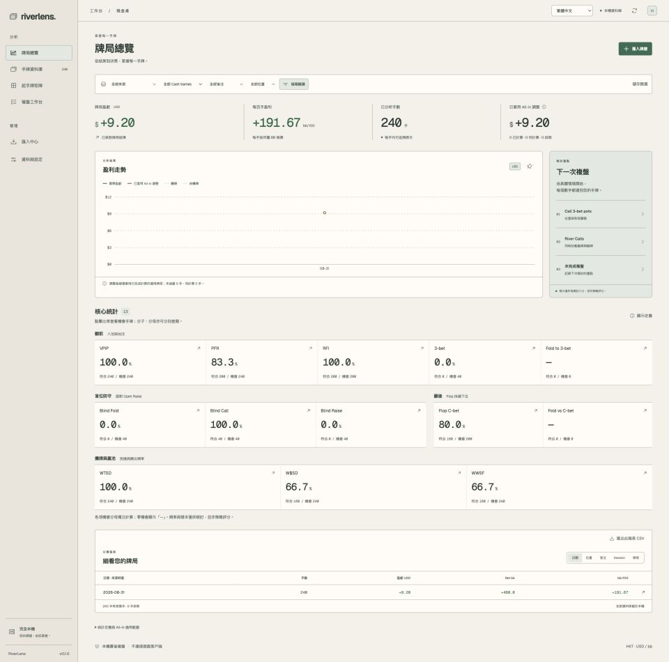

# RiverLens

**您的牌譜，由您掌握。以本機資料為本的賽後 Poker 複盤工作台。**

[English](README.md) · [繁體中文](README.zh-TW.md) · [简体中文](README.zh-CN.md) · [日本語](README.ja.md) · [한국어](README.ko.md) · [Français](README.fr.md) · [Deutsch](README.de.md) · [Español](README.es.md) · [Português (Brasil)](README.pt-BR.md) · [Italiano](README.it.md) · [Nederlands](README.nl.md) · [Polski](README.pl.md) · [Türkçe](README.tr.md)

RiverLens 是 Natural8／GGPoker 個人現金桌牌譜分析桌面工具。介面使用 React／TypeScript，Rust core 負責解析、統計與本機 SQLite 儲存。

> **[下載 v0.3.0](https://github.com/G-Loop-co/riverlens/releases/tag/v0.3.0)** — AI 教練、本機 MCP agent 連接及離線學習。提供 Windows、Apple Silicon、Intel Mac 套件。[發布說明](docs/release-v0.3.0.md)。



README 共 **13 種語言**；App 介面維持 **English／繁中／簡中**。

**v0.3.0** 新增 AI 複盤，保留 Spot Explorer → Leak Finder → 翻前策略對照 → Trainer。策略包需自行提供；頻率對照不是 decision EV。[學習工作台](docs/study-workflow.md) · [主題](docs/theme-selection.md)。

## 功能

| 功能 | 用途 |
| --- | --- |
| AI 教練與 agent 連接 | 透過 17 個本機 MCP 工具查閱統計與決策情境，建立附手牌依據的複盤、練習及學習計劃草稿，由您確認。 |
| 匯入中心 | 匯入 TXT、ZIP 或資料夾；查看進度、暫停／續匯、去重及異常隔離。 |
| 盈虧總覽 | 查看淨盈虧、bb/100、Session 與位置分類，點入原始手牌。 |
| 13 項核心統計 | VPIP、PFR、RFI、3-bet、盲位防守及翻後／攤牌頻率；分子、機會分母可分別查閱。 |
| 13 × 13 起手牌矩陣 | 查看實際樣本、net bb、bb/100、行動頻率，開啟對應手牌。 |
| 手牌回放 | 逐步行動、跳街、自動播放及已知底牌。 |
| 複盤工作台 | 保存筆記、標籤、已複盤狀態及常用篩選。 |
| 本機資料管理 | SQLite 儲存、CSV／牌譜匯出、備份及還原。 |
| 外觀主題 | 森林綠、午夜藍、暖白；選擇儲存於本機。 |
| 三語介面 | 即時切換繁中、簡中及 English，離線可用。 |
| 適用 All-in equity | 支援單挑、單底池、已知底牌、單 runout 的適用情況；不是 decision EV 或 GTO 評分。 |


截圖採 **1920px 桌面寬度、完整頁面、暖白主題**；另提供 [1920 × 1080 完整視窗](docs/screenshots/overview-desktop-en.jpg)。

截圖全部使用 **240 手合成資料**，不包含私人牌譜。重複樣本僅示範介面，不代表真實玩家頻率或策略建議。矩陣呈現已觀察手牌，並非建議範圍。

## AI 功能與快速上手

查閱統計、分析指定決策、找出值得檢討的局面，並建立附手牌依據的練習或學習計劃草稿。草稿需由您確認；AI 與原有離線學習資料庫目前分開。

**使用外部 agent：RiverLens 不需要 provider API key**

1. 匯入已完成的牌譜，保持 RiverLens 開啟。
2. 開啟「**AI 教練 → AI 連接 → 啟用本機連接**」，將顯示的設定複製到支援 **stdio MCP** 的客戶端，例如 Codex。
3. 輸入：「找出最值得檢討的 leak candidates，列出樣本量及手牌依據，再建立練習草稿。」到「**學習資料**」檢視並確認草稿。

外部 agent 可能需要自己的登入／訂閱。重啟 RiverLens 後需更新連接設定；「**撤銷連接**」可停止存取。

**使用 App 內 AI 教練：需要 API key**

在「**AI 連接**」儲存 OpenAI、Anthropic 或 Gemini key，再於「**AI 教練**」選擇相容 model、分享範圍並提問；亦可從手牌回放按「**問 AI**」。

選定內容可能傳送至模型供應商，包括經外部 agent 傳送。Key 存於系統憑證庫。雲端供應商實際呼叫尚未驗證；無 key 仍可使用離線學習。[完整設定與限制](docs/ai-agent-coach.md)。

## 開始使用

需要 Node.js 22+、Rust stable 及 [Tauri 平台前置工具](https://v2.tauri.app/start/prerequisites/)：macOS 使用 Xcode Command Line Tools；Windows 使用 MSVC C++ Build Tools 與 WebView2。

```sh
git clone https://github.com/G-Loop-co/riverlens.git
cd riverlens
npm ci
npm run desktop
```

1. 從 PokerCraft 匯出自己已完成的 TXT／ZIP 牌譜。
2. 在「資料與設定」確認品牌、Hero 名稱及**牌譜內文時區**。
3. 在「匯入中心」匯入檔案。
4. 查看總覽、矩陣及逐手回放。
5. 保存筆記，定期備份資料庫。

## 本機開發

```sh
# Terminal 1：Rust core，只綁定 127.0.0.1
npm run serve:core
# Terminal 2：瀏覽器預覽 http://127.0.0.1:1420
npm run dev
```

桌面版使用 Tauri IPC 及原生檔案對話框；瀏覽器預覽使用相同 Rust core，以開發用路徑輸入代替檔案對話框。

```sh
npm test
npm run core:test
npm run build
node scripts/cargo.mjs clippy -p poker-core --all-targets -- -D warnings
npm run desktop:build -- --bundles app
# Windows 原生 runner：
npm run desktop:build -- --target x86_64-pc-windows-msvc --bundles nsis
```

資料存於 Tauri app-data 目錄（`app.riverlens.desktop`），設定頁會顯示實際位置。瀏覽器開發使用 `.local/riverlens.db`。運作中的 SQLite 請使用內建備份功能，確保 WAL 資料一併處理。

## 範圍與發布狀態

本工具供個人離線賽後複盤；不連接遊戲客戶端，沒有即時 HUD、RTA、群體資料挖掘、雲端同步或 GTO 最佳行動評分。與 Natural8／GGPoker 無隸屬關係。

v0.3.0 包含 AI／MCP 整合及離線學習流程；不包含私人牌譜、本機資料庫或策略包。驗收限制見[發布說明](docs/release-v0.3.0.md)。

- [使用說明](docs/user-guide.md)
- [架構與統計定義](docs/architecture.md)
- [研究與既有元件](docs/research-matrix.md)
- [驗證與限制](docs/validation.md)
- [版本紀錄](CHANGELOG.md)
- [第三方元件](THIRD_PARTY.md)
- [Releases](https://github.com/G-Loop-co/riverlens/releases)

## 授權

Repo 公開，但尚未選定專案整體再利用授權；不可假設 RiverLens 本身採 MIT 或 Apache。第三方元件保留各自授權，見 [THIRD_PARTY.md](THIRD_PARTY.md)。
